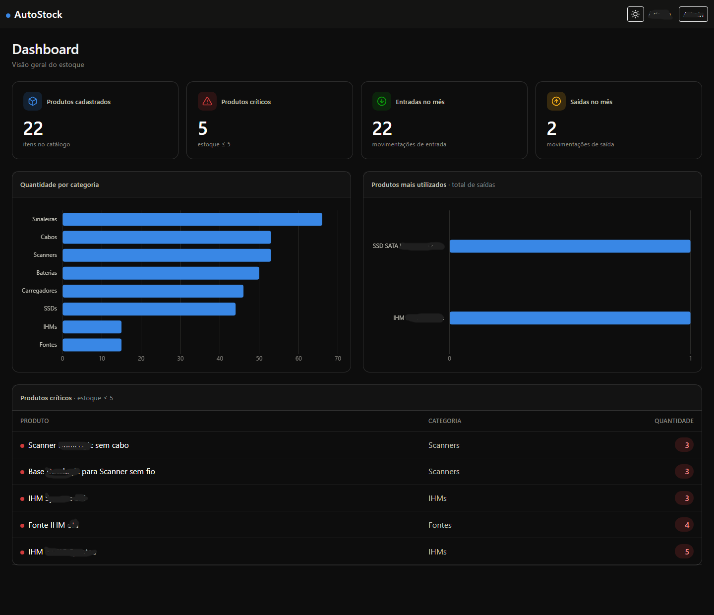
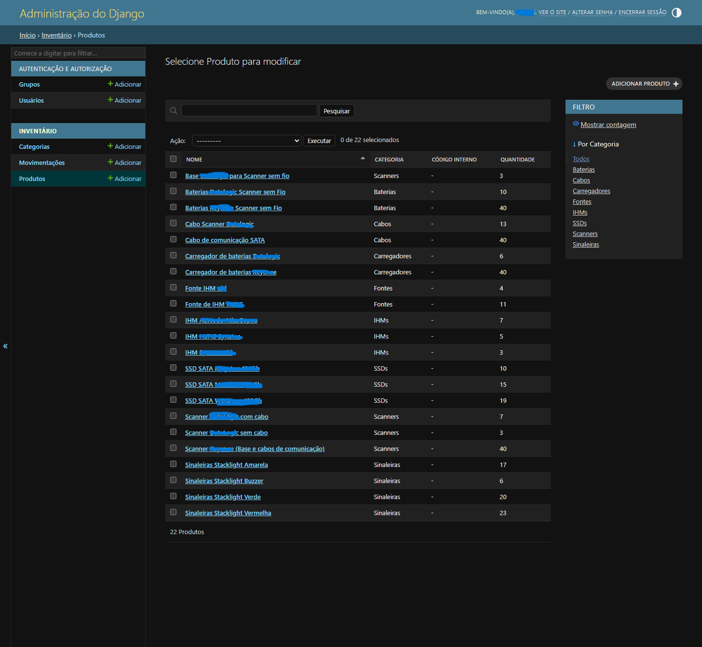
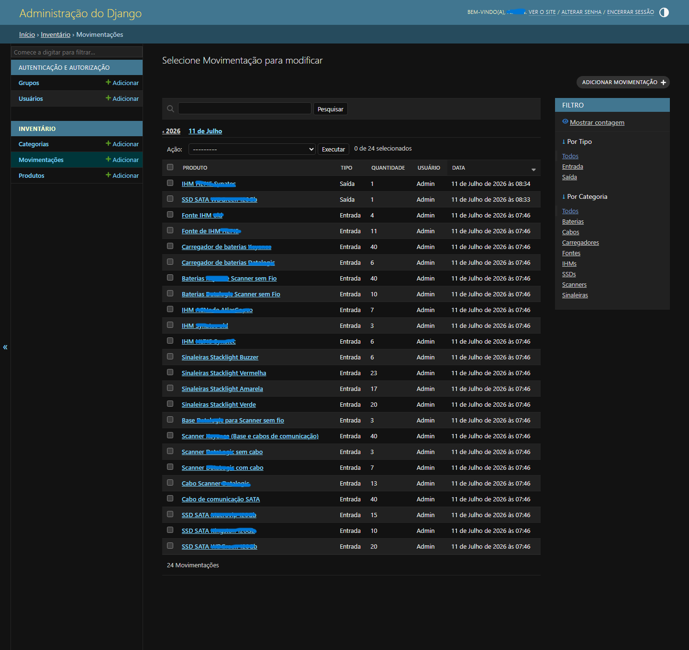

# AutoStock

Sistema web de gestão de estoque desenvolvido com **Python** e **Django**, criado para controlar componentes utilizados em ambientes industriais.

O sistema centraliza o cadastro de produtos, registra movimentações de entrada e saída, calcula automaticamente o saldo de cada item e apresenta indicadores operacionais em um dashboard responsivo.

> Este repositório utiliza exclusivamente dados fictícios para fins de demonstração e portfólio.

---

# Interface

## Dashboard



---

## Catálogo de Produtos



---

## Auditoria de Movimentações



---

# Funcionalidades

- Cadastro de categorias
- Cadastro de produtos
- Registro de entradas de estoque
- Registro de saídas de estoque
- Atualização automática do saldo
- Dashboard com indicadores
- Produtos críticos
- Histórico completo das movimentações
- Autenticação integrada ao Django Admin
- Tema claro e escuro
- Documentação automática do modelo de dados
- Carga idempotente de dados demonstrativos

---

# Arquitetura

O AutoStock foi desenvolvido utilizando a arquitetura MVC do Django.

Toda a regra de negócio permanece concentrada na aplicação **inventory**, enquanto o projeto **config** contém apenas configurações globais.

O principal conceito do sistema é:

> O estoque nunca é alterado manualmente.

Cada movimentação registrada gera automaticamente uma atualização no saldo do produto.

Essa abordagem elimina inconsistências entre estoque e histórico, mantendo toda movimentação rastreável.

---

# Tecnologias

| Camada | Tecnologia |
|---------|------------|
| Backend | Python 3 |
| Framework | Django 6 |
| Banco de dados | SQLite |
| Front-end | Django Templates |
| Interface | Bootstrap 5 |
| Gráficos | Chart.js |
| Configuração | python-dotenv |

---

# Estrutura

```
AutoStock
│
├── config/
│
├── inventory/
│   ├── models.py
│   ├── admin.py
│   ├── views.py
│   ├── urls.py
│   ├── tests.py
│   └── management/
│
├── templates/
│
├── static/
│
├── docs/
│   └── images/
│
├── manage.py
│
└── requirements.txt
```

---

# Modelo de Dados

```
Categoria
      │
      ▼
 Produto
      │
      ▼
Movimentação
```

Cada movimentação representa uma entrada ou saída de estoque.

O saldo do produto é atualizado automaticamente utilizando operações atômicas.

Categorias e produtos utilizados por movimentações permanecem protegidos contra exclusão, preservando a integridade do histórico.

A documentação completa pode ser regenerada utilizando:

```bash
python manage.py gerar_documentacao
```

---

# Instalação

Clone o projeto.

```bash
git clone https://github.com/LeonardoHRamos/AutoStock
```

Entre na pasta.

```bash
cd AutoStock
```

Crie um ambiente virtual.

Windows

```bash
python -m venv .venv
.venv\Scripts\activate
```

Linux

```bash
python3 -m venv .venv
source .venv/bin/activate
```

Instale as dependências.

```bash
pip install -r requirements.txt
```

Crie o arquivo de ambiente.

Windows

```powershell
Copy-Item .env.example .env
```

Linux

```bash
cp .env.example .env
```

Execute as migrações.

```bash
python manage.py migrate
```

Crie um usuário administrador.

```bash
python manage.py createsuperuser
```

Inicie a aplicação.

```bash
python manage.py runserver
```

Dashboard:

```
http://localhost:8000/
```

Admin:

```
http://localhost:8000/admin/
```

---

# Comandos úteis

Carga de dados demonstrativos.

```bash
python manage.py seed_inventario
```

Gerar documentação.

```bash
python manage.py gerar_documentacao
```

Executar testes.

```bash
python manage.py test
```

Verificações do projeto.

```bash
python manage.py check
```

---

# Testes

O projeto possui testes automatizados cobrindo:

- atualização automática do saldo;
- entradas e saídas;
- integridade das movimentações;
- carga inicial de dados;
- consistência da regra de negócio.

---

# Segurança

- `.env` não é versionado.
- `db.sqlite3` permanece apenas localmente.
- O projeto utiliza somente dados fictícios.
- Configurações sensíveis são carregadas por variáveis de ambiente.

---

# Roadmap

- [ ] Validação de estoque negativo
- [ ] Movimentações imutáveis
- [ ] PostgreSQL
- [ ] Docker
- [ ] API REST
- [ ] Controle de permissões por perfil
- [ ] Auditoria avançada
- [ ] Deploy em produção

---

# Autor

**Leonardo Henrique Ramos**

Software Engineer • Electrical Engineer

Python • Django • JavaScript • Industrial Automation
